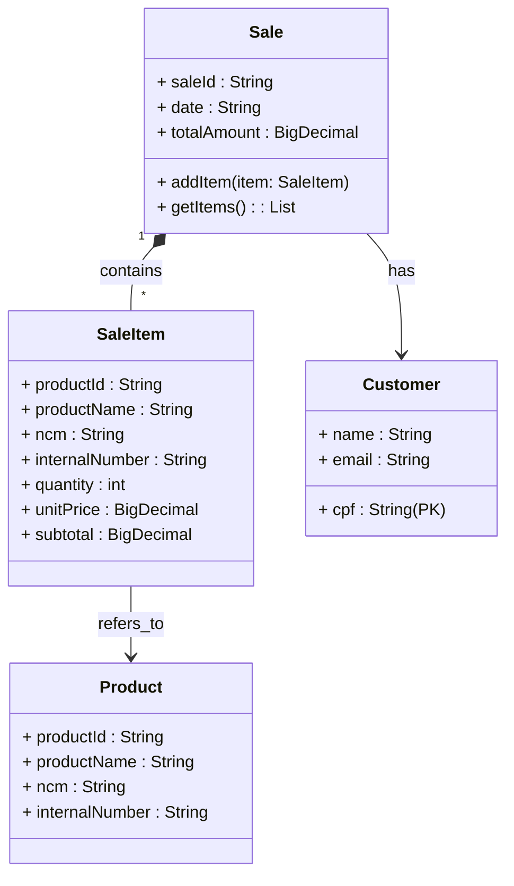

# MTP-POS
Sistema de ponto de venda.

## Digrama de classes

```mermaid
classDiagram
    class Sale {
        + saleId : String
        + date : String
        + totalAmount : BigDecimal
        + addItem(item: SaleItem)
        + getItems() : List<SaleItem>
    }

    class SaleItem {
        + productId : String
        + productName : String
        + ncm : String
        + internalNumber : String
        + quantity : int
        + unitPrice : BigDecimal
        + subtotal : BigDecimal
    }

    class Customer {
        + cpf : String (PK)
        + name : String
        + email : String
    }

    class Product {
        + productId : String
        + productName : String
        + ncm : String
        + internalNumber : String
    }

    Sale "1" *-- "*" SaleItem : contains
    SaleItem --> Product : refers_to
    Sale --> Customer : has

```
